# mermaid

## Flowchart

縦フロー

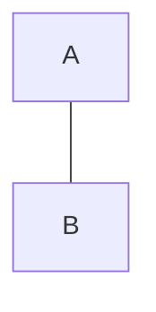
```mermaid
flowchart TB
    A --- B
```

横フロー

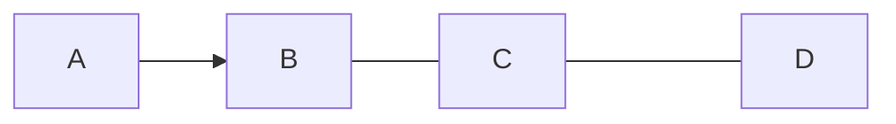
```mermaid
flowchart LR
    A --> B --- C ---- D
```

連結

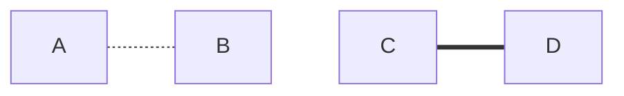
```mermaid
flowchart LR
    A -.- B ~~~ C === D
```

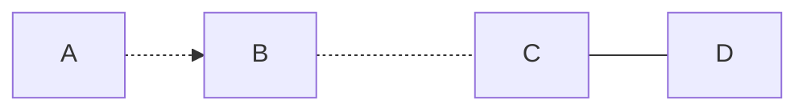
```mermaid
flowchart LR
    A -.-> B -..- C --- D
```

結合部

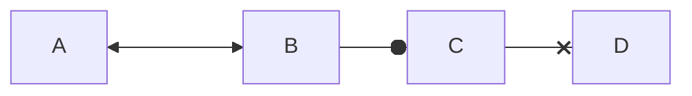
```mermaid
flowchart LR
    A <---> B --o C --x D
```

複数まとめて入出力

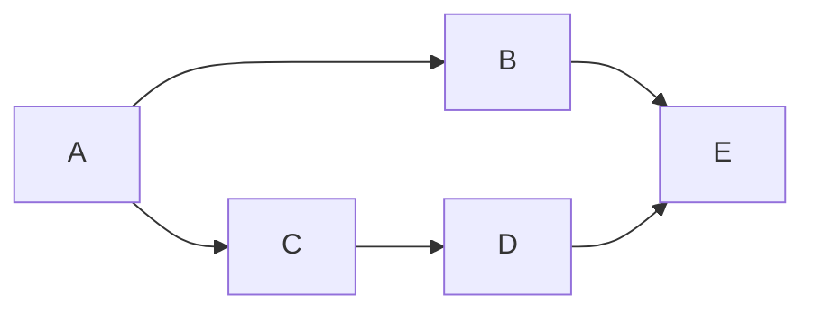
```mermaid
flowchart LR
    A --> B & C
    C --> D
    B & D --> E
```

テキスト入力

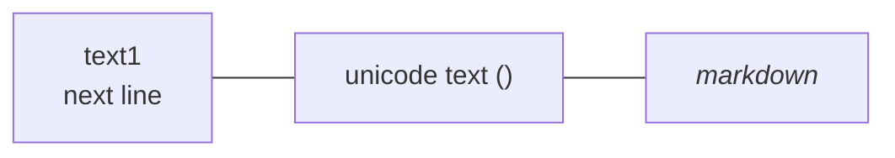
```mermaid
%% comment
flowchart LR
    A[text1
    next line]
    B["unicode text ()"] --- C["`_markdown_`"]
    A --- B
```

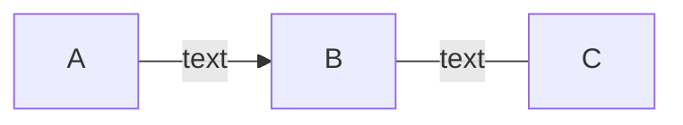
```mermaid
flowchart LR
    A -- text --> B ---|text| C
```

図形種類

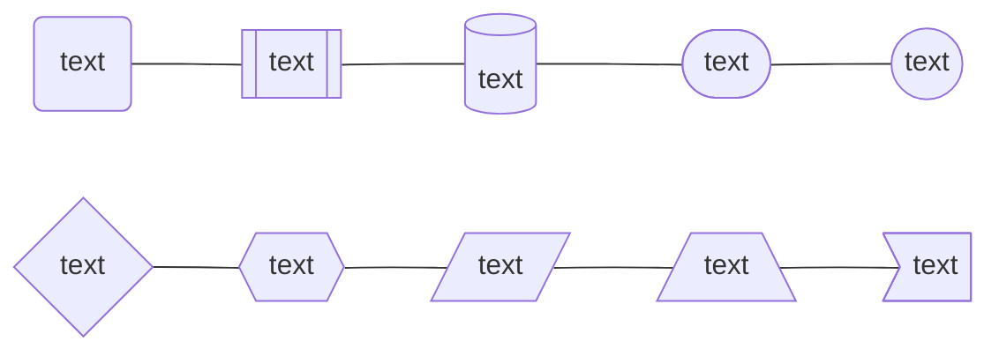
```mermaid
flowchart LR
    A(text) --- B[[text]] --- C[(text)] --- D([text]) --- E((text))
    F{text} --- G{{text}} --- H[/text/] --- I[/text\] --- J>text]
```

Sub graph

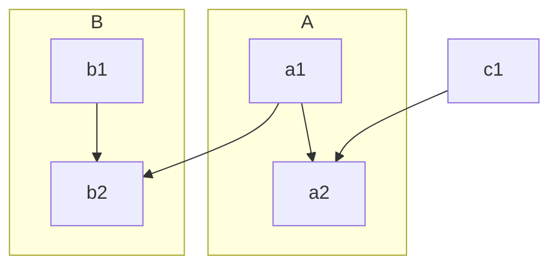
```mermaid
flowchart TB
    a1 --> b2
    subgraph A
        a1 --> a2
    end
    subgraph B
        b1 --> b2
    end
    c1 --> a2
```

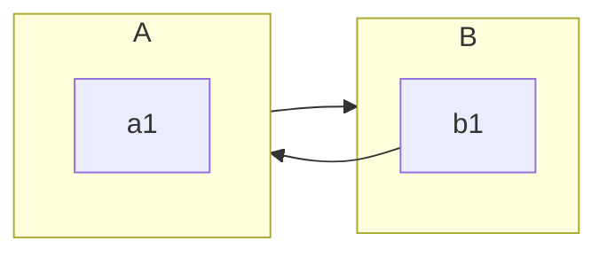
```mermaid
flowchart LR
    subgraph A
        a1
    end
    subgraph B
        b1
    end
    A --> B
    b1 --> A
```

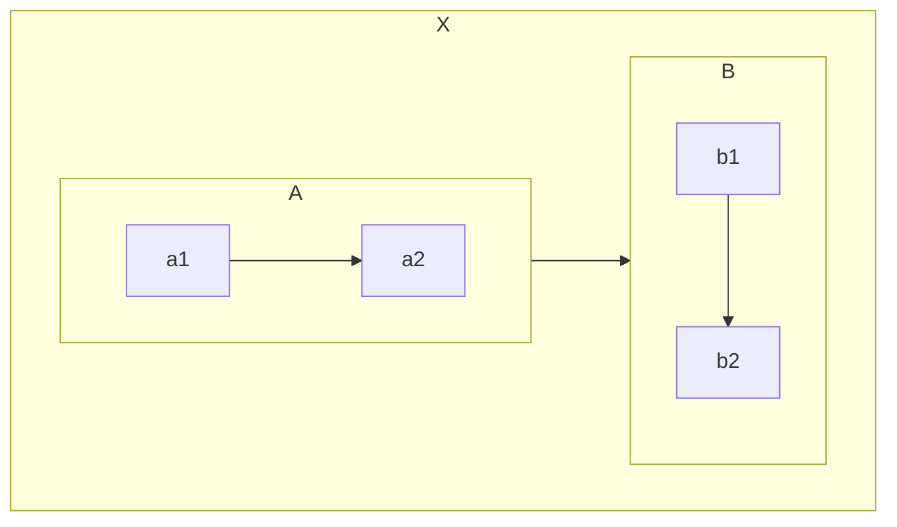
```mermaid
flowchart LR
    subgraph X
        direction LR
        subgraph A
            direction LR
            a1 --> a2
        end
        subgraph B
            direction TB
            b1 --> b2
        end
    end
    A --> B
```

## Class disgram

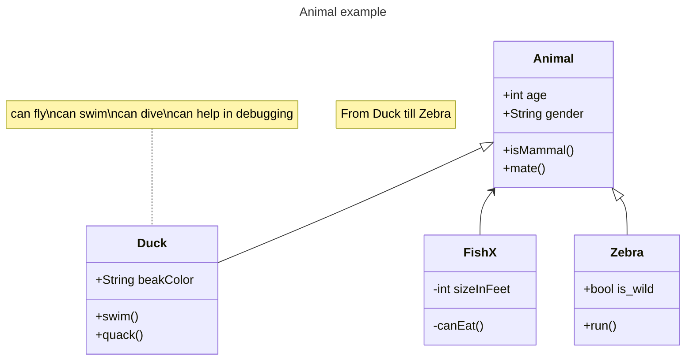
```mermaid
---
title: Animal example
---
classDiagram
    note "From Duck till Zebra"
    Animal <|-- Duck
    note for Duck "can fly\ncan swim\ncan dive\ncan help in debugging"
    Animal <-- Fish
    Animal <|-- Zebra
    Animal : +int age
    Animal : +String gender
    Animal : +isMammal()
    Animal : +mate()
    class Duck{
        +String beakColor
        +swim()
        +quack()
    }
    class Fish["FishX"]{
        -int sizeInFeet
        -canEat()
    }
    class Zebra
    Zebra : +bool is_wild
    Zebra : +run()
```

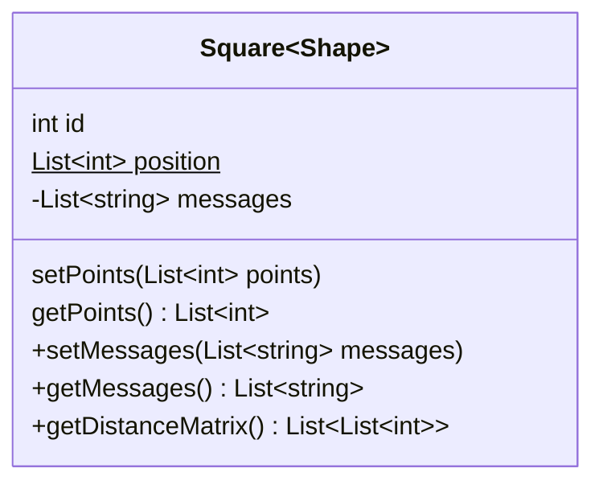
```mermaid
classDiagram
class Square~Shape~{
    int id
    List~int~ position $
    setPoints(List~int~ points)
    getPoints() List~int~
}

Square : -List~string~ messages
Square : +setMessages(List~string~ messages)
Square : +getMessages() List~string~
Square : +getDistanceMatrix() List~List~int~~
%% +: public, -: private, #: protected, ~: internal *: abstract, $: static
```

Relationship

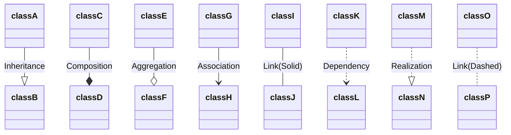
```mermaid
classDiagram
classA --|> classB : Inheritance
classC --* classD : Composition
classE --o classF : Aggregation
classG --> classH : Association
classI -- classJ : Link(Solid)
classK ..> classL : Dependency
classM ..|> classN : Realization
classO .. classP : Link(Dashed)
```

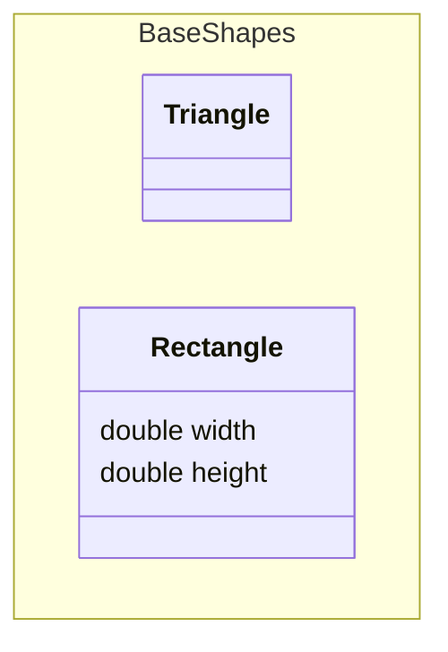
```mermaid
classDiagram
namespace BaseShapes {
    class Triangle
    class Rectangle {
      double width
      double height
    }
}
```

## mindmap

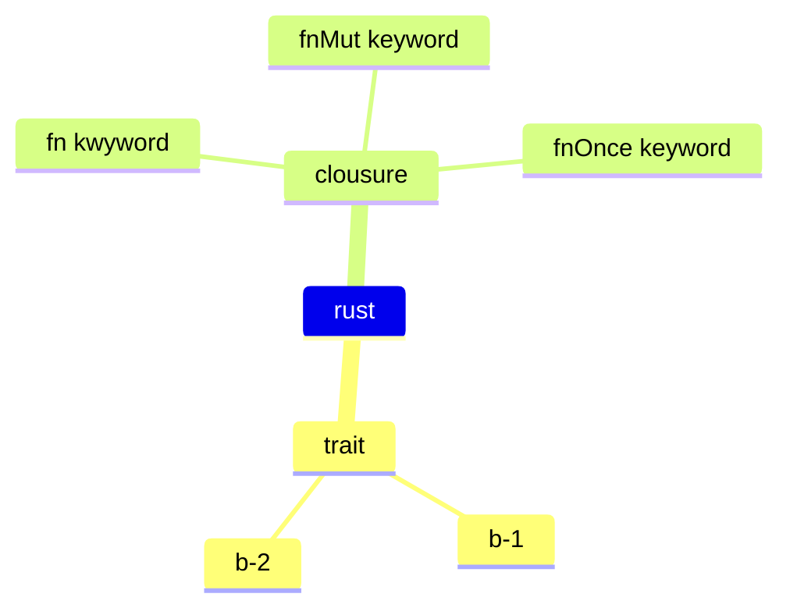
```mermaid
mindmap
rust
    trait
        b-1
        b-2
    clousure
        fn kwyword
        fnMut keyword
        fnOnce keyword
```
